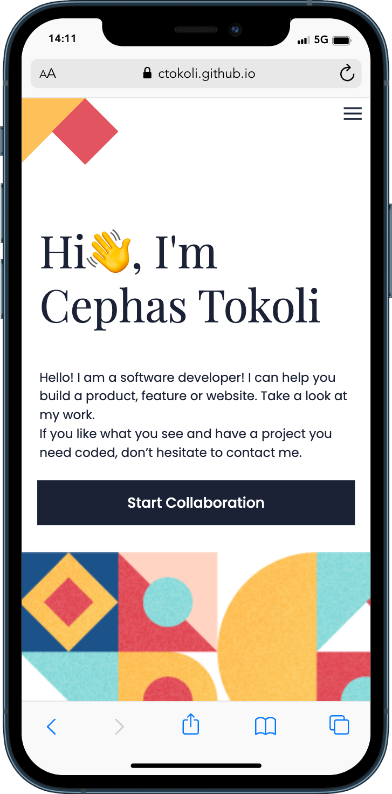
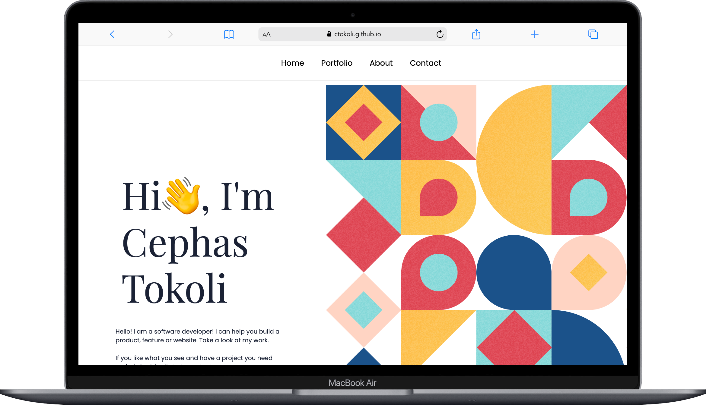

<a name="readme-top"></a>


# 📗 Table of Contents

- [� Table of Contents](#-table-of-contents)
- [📖 Hello-Microverse ](#-Hello-Microverse-)
  - [🛠 Built With ](#-built-with-)
    - [Tech Stack ](#tech-stack-)
    - [Key Features ](#key-features-)
  - [💻 Getting Started ](#-getting-started-)
    - [Prerequisites](#prerequisites)
    - [Setup](#setup)
    - [Install](#install)
    - [Usage](#usage)
    - [Run tests](#run-tests)
    - [Deployment ](#deployment-)
  - [👤 Author ](#-author-)
  - [🔭 Future Features ](#-future-features-)
  - [🤝 Contributing ](#-contributing-)
  - [⭐️ Show your support ](#️-show-your-support-)
  - [🙏 Acknowledgments ](#-acknowledgments-)
  - [❓ FAQ ](#-faq-)
  - [📝 License ](#-license-)

# 📖 Personal Portfolio <a name="about-project"></a>

**Personal Portfolio**  The goal of this first project is to learn how to parse Figma designs and create a user interface, using Flexbox to place elements on the page, and using images as backgrounds.


<div align="center">

  <h3><b>Personal Portfolio</b></h3>

</div>

<!-- PROJECT DESCRIPTION -->   


## 🛠 Built With <a name="built-with"></a>

### Tech Stack <a name="tech-stack"></a>


<details>
  <summary>Client</summary>
  <ul>
    <li><a href="https://developer.mozilla.org/en-US/docs/Learn/Getting_started_with_the_web/HTML_basics">HTML5</a></li>
    <li><a href="https://developer.mozilla.org/en-US/docs/Learn/Getting_started_with_the_web/CSS_basics">CSS3</a></li>
   
  </ul>
</details>

### Key Features <a name="key-features"></a>

- **Responsive UI**
- **Track CSS Errors**
- **Track CSS Errors**

<p align="right">(<a href="#readme-top">back to top</a>)</p>

## 💻 Getting Started <a name="getting-started"></a>

To get a local copy up and running, follow these steps.

### Prerequisites

In order to run this project you need:

- A web browser to view output e.g [Google Chrome](https://www.google.com/chrome/).
- An IDE e.g [Visual studio code](https://code.visualstudio.com/).
- `node` should be installed in your local machine, [node website](https://nodejs.org/en/download/).
- Install the `npm` package manager use this [to install both node and npm](https://docs.npmjs.com/downloading-and-installing-node-js-and-npm).
- [A terminal](https://code.visualstudio.com/docs/terminal/basics).

### Setup

Clone this repository to your desired folder or download the Zip folder:

```
git clone https://github.com/ctokoli/Hello-Microverse.git
```

- Navigate to the location of the folder in your machine:

**``you@your-Pc-name:~$ cd Hello Microverse``**

### Install

To install all dependencies, run:

```
npm install
```

### Usage

To run the project, follow these instructions:

- After Cloning this repo to your local machine.
- Open the `index.html` in your browser.

### Run tests

To run tests, run the following command:

- Track HTML linter errors run:
```
npx hint .
```
- Track CSS linter errors run:
```
npx stylelint "**/*.{css,scss}"
```


### Deployment <a name="deployment"></a>

You can deploy this project using: GitHub Pages,
- I used GitHub Pages to deploy my website.
- For more information about publishing sources, see "[About GitHub pages](https://docs.github.com/en/pages/getting-started-with-github-pages/about-github-pages#publishing-sources-for-github-pages-sites)".


## 🚀 Live Demo <a name="live-demo"></a>

- [Here is the link to the live experience](https://ctokoli.github.io/personal-portfolio-site/).

> |     | Mobile version                      | Desktop version                      |     |
> | --- | ----------------------------------- | ------------------------------------ | --- |
> |     |  |  |


<p align="right">(<a href="#readme-top">back to top</a>)</p>

## 👤 Author <a name="author"></a>

👤 **Cephas, Tokoli**

- GitHub: [@Ctokoli](https://github.com/ctokoli/)
- Twitter: [@Ctokoli](https://twitter.com/ctokoli)
- LinkedIn: [Cephas Tokoli](https://www.linkedin.com/in/cephas-tokoli-a25204123/)

<p align="right">(<a href="#readme-top">back to top</a>)</p>

## 🔭 Future Features <a name="future-features"></a>

- [ ] **Implement About us section**
- [ ] **Implement a footer**
- [ ] **Add a form in the footer**

<p align="right">(<a href="#readme-top">back to top</a>)</p>

## 🤝 Contributing <a name="contributing"></a>

Contributions, issues, and feature requests are welcome!

Feel free to check the [issues page](../../issues/).

<p align="right">(<a href="#readme-top">back to top</a>)</p>

## ⭐️ Show your support <a name="support"></a>


Give a ⭐️ if you like this project and how I managed to build it!

<p align="right">(<a href="#readme-top">back to top</a>)</p>

## 🙏 Acknowledgments <a name="acknowledgements"></a>


- Project from [Microverse](https://www.microverse.org/) html & css module.
- Thanks to the Microverse team for the great curriculum.
- Thanks to the Code Reviewer(s) for the insightful feedbacks.
- A great thanks to My coding partner(s), morning session team, and standup team for their contributions.
- Hat tip to anyone whose code was used.

<p align="right">(<a href="#readme-top">back to top</a>)</p>

## ❓ FAQ <a name="faq"></a>

- **Can I fork and reuse the repository**

  - Yes please, feel free.

- **Can I improve the repository, and my changes will be accepted if they are good?**

  - Yes please, nice ideas are welcome, please.

<p align="right">(<a href="#readme-top">back to top</a>)</p>

## 📝 License <a name="license"></a>

This project is [MIT](./MIT.md) licensed.

<p align="right">(<a href="#readme-top">back to top</a>)</p>

